**Chapter 1 - The Machine Learning Landscape**

**Table of Contents**

- [What is Machine Learning](#what-is-machine-learning)
- [Why Use Machine Learning?](#why-use-machine-learning)
  - [Examples](#examples)
- [Types of Machine Learning Systems](#types-of-machine-learning-systems)
  - [Training Supervision](#training-supervision)
    - [1. Supervised Learning](#1-supervised-learning)
    - [2. Unsupervised Learning](#2-unsupervised-learning)
    - [3. Semi-Supervised Learning](#3-semi-supervised-learning)
    - [4. Self-Supervised Learning](#4-self-supervised-learning)
    - [5. Reinforcement Learning](#5-reinforcement-learning)
  - [Batch VS Online Learning](#batch-vs-online-learning)
    - [Batch Learning](#batch-learning)
    - [Online Learning](#online-learning)
  - [Instance-Based VS Model-Based Learning](#instance-based-vs-model-based-learning)
    - [Instance-based learning](#instance-based-learning)
    - [Model-based learning and typical machine learning workflow](#model-based-learning-and-typical-machine-learning-workflow)
- [Main Challenges of Machine Learning](#main-challenges-of-machine-learning)
  - [Insufficient Quantity of Training Data](#insufficient-quantity-of-training-data)
  - [Nonrepresentative Training Data](#nonrepresentative-training-data)
  - [Poor-Quality Data](#poor-quality-data)
  - [Irrelevant features](#irrelevant-features)
  - [Overfitting the Training Data](#overfitting-the-training-data)
  - [Underfitting the Training Data](#underfitting-the-training-data)
- [Testing and Validating](#testing-and-validating)
  - [Hyperparameter Tuning and Model Selection](#hyperparameter-tuning-and-model-selection)
  - [Data Mismatch](#data-mismatch)
    - [No Free Lunch Theorem](#no-free-lunch-theorem)
- [Exercises](#exercises)

## What is Machine Learning 

- Machine Learning is the study that gives computers the ability to learn without being explicitly programmed.  
    - Spam Filter 

- Part of ML System that is used to learn is the *training set* / *training instance* / *sample*
- Part of ML System that learns and makes predictions is called a *model* 
    - Neural Networks and Random Forests are examples of models

## Why Use Machine Learning?

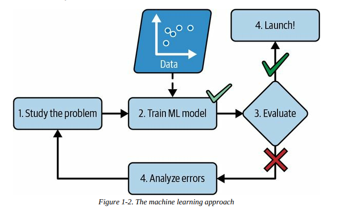

- Machine Learning models can learn based on new data and change rules on the fly. 
    - ML Spam Filters can detect words and phrases that are used in spam. 

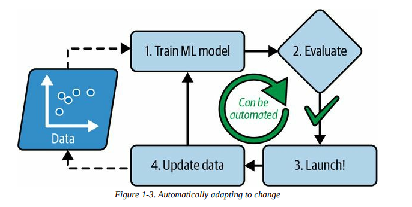

- ML also good for problems that are too complex for traditional coding approaches or have no known algorithm

- ML models can also be used to learn from the data set they learn from. We can dig into large amounts of data to discover hidden patterns, **data mining**.

### Examples
1. Image analysis of products on a production line to auto classify them
    - Image classification, typically done using **convolution neural networks** (CNN) or using **transformers**
2. Detecting tumors in brain scans
    - Semantic image segmentation, where each pixel is classfiied. Typically done using **CNNs** or **transformers**
3. Auto classifying news articles
    - **Natural Language Processing**(NLP), more specifically text classification. Tackled by **recurrent neural networks** (RNNs) and **CNNs**, but **transformers** work even better
4. Auto-summarize long documents
    - Branch of **NLP** called text summarization
5. Chatbots / Personal Assistants
    - **Natural Language Understanding** (NLU) and question-answering modules
6. Forecasting company revenue for the next year
    - Regression task handled by any regression model such as **linear regression** or **polynomial regression**, **regression support vector machine**, **regression random forest**, **artificial neural network**. If you want to take into account sequences of past performance metrics, may want to use **RNNs**, **CNNs**, or **transformers**. 

## Types of Machine Learning Systems

* We classify machine learning systems into broad categories based on following criteria:
    * How they are supervised during training
        * **Supervised, unsupervised, semi-supervised, self-supervised, and others**
    * Whether or not they can learn incrementally on the fly
        * **online vs batch-learning**
    * Whether they work by simply comparing new data points to known data points, or instead by detecting patterns in training data and building a predictive model 
        * **instance-based vs model-based learning**
* These criteria are not exclusive and can be combined in any way you like

### Training Supervision

* ML Systems can be classified according to amount and type of supervision they get during training. 

#### 1. Supervised Learning

* Training set that is fed into algorithm also includes desired solutions

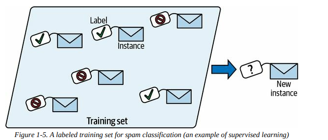

* Typical supercised learning task is **classification**.
    * Spam filter is trained with many example emails along with their **class**, spam or ham in this case, and must learn how to classify new emails

* Another task is to predict a target numeric value, such as price of a car given features. This is called **regression**.
    * Need to give the system many examples of cars, including features and targets. 
* Some regression models can be used for classification as well and vice versa. 
    * **Logistic Regression** is commonly used for classification, as it ouputs a value that corresponds to the probability of belonging to a given class. 

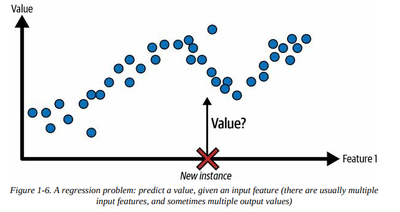

#### 2. Unsupervised Learning

* Training data is unlabeled and the system tries to learn without a teacher. 
    * For example, data on your blog's visitors. Run a *clustering algorithm* to try and detect groups of similar visitors. The algorithm should find connections without your intervention. 
        * This can be expanded upon with **hierarchical clustering** that will subdivide each group into smaller groups. 

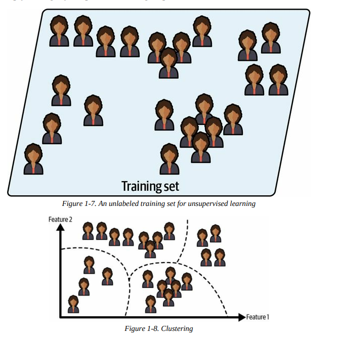

* **Visualization** algorithms are also examples of unsupervised learning. They will output 2D or 3D representation of complex and unlabeled data and will attempt to preserve as much structure as possible. 
    * Related task is **dimensionality reduction**, where the goal is to simplify the data without losing too much information. 
        * One way to accomplish this is to merge several correlated features into one.
        * A car's mileage may be strongly correlated to its age, so the *dimensionality reduction algorithm* will merge them into one feature that represents the car's wear and tear. This is **feature extracion**

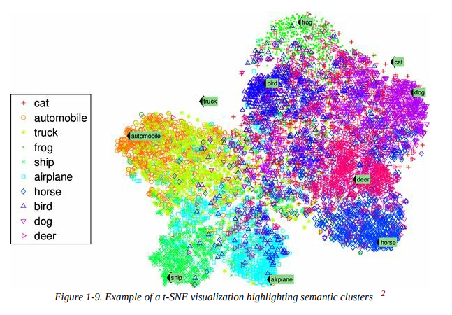

* **Anomaly Detection** is used to detect outliers in a data set 
    * Detect fraudulent credit card transactions, manufacturing defects, auto-remove outliers from a data set before feeding it into learning algorithm. 
    * **Novelty Detection** aims to detect new instances that look different from all instances in a set. 
        * Requires having a very clean training set, without any instance that you would like the algorithm to detect. 
        * If you have thousands of pictures dogs and 1% are Chihuahuas, a *novelty detection algorithm* should not treat new pictures of Chihuahaus as novelties. 
            * *Anomaly detection algorithms* may consider these dogs so rare and different from other dogs that they would be classified as anomalies. 

* **Association Rule Learning** is used with the goal of digging into large amounts of data and discover interesting relations between attributes. 
    * If you ran a supermarket and ran an association rule on your sales log, you might find that people who buy bbq sauce and potato chips also tend to buy steak. This might affect how you place these items around your store.

#### 3. Semi-Supervised Learning

* Training set has labeled AND unlabeled instances. The data set is considered partially labelled. 

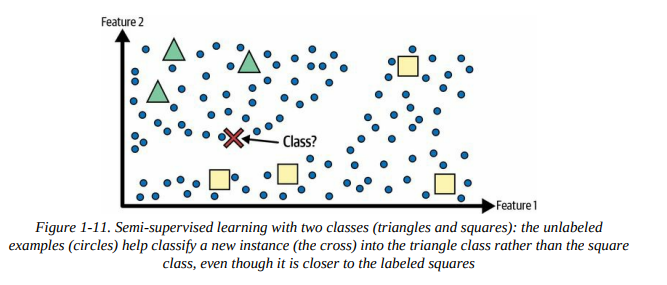

* Google Photos does this by recognizing Person A in pictures 1, 5, and 11, while Person B shows up in 2, 5, and 7. This part of the algorithm is *unsupervised* (clustering). The system might ask you to label these people, and once you add one label per person it will be able to name everyone in every photo. This can be used later to search for people in photos.

* Most semi-supervised learning algorithms are combos of unsupervised and supervised algorithms. 
    * A clustering algorithm might be used to group similar instances together, and then every unlabeled instance can be labeled with the most commo label in its cluster. Once the whole dataset is labeled, it can be run into any supervised learning algorithm. 

#### 4. Self-Supervised Learning

* Machine Learning model generates a fully labeled dataset from a completely unlabeled set. Once the set has been labeled by the model completely, it can be run through any *supervised* learning algorithm. 

* If you had a large dataset of unlabeled images, you can randomly mask a small part of each image and train the model to recover the original image. 
    * During training, the masked images are used as inputs to the model and the original images are used as labels. 

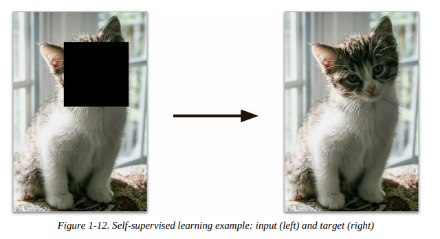

* This can be used to repair damaged images or to erase unwanted objects from pictures. 

* A model trained on self-supervised learning is often not the final goal. You will usually want to use the knowledge gained by the model in this time and transition it to another purpose. 
    * You could train a model to repair images of different animal species, wherein it will eventually know how to repair images of cats and dogs correctly. This has implied understanding of recognizing and distinguishing different animal species. 
    * Transferring knowledge from one task to another is called **transfer learning**. 

#### 5. Reinforcement Learning

* How it works:
    * The learning system, called the **agent**, can observe the environment, select and perform actions, and get rewards in return (or *penalties* in the form of negative rewards)
    * It must then learn by itself what is the best strategy, or **policy** to get the most reward over time. A **policy** defines what action the agent shoudl choose when it is in a given sitaution. 

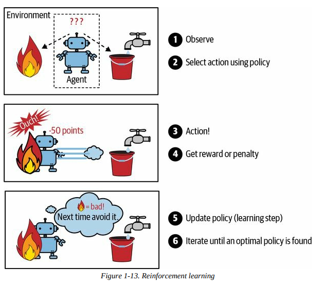

* The most prominent example would be DeepMind's AlphaGo program
    * Beat the number one ranked Go player at the time, Ke Jie, in May 2017
    * Learned its winning policy by analyzing millions of games and then playing many games against itself. 
        * Learning was turned off during the game against Jie; AlphaGo was merely applying the policy it had learned. This is **offline learning**. 

### Batch VS Online Learning

#### Batch Learning

* The system is incapable of learning incrementally; it must be trained using all the available data beforehand. This typically takes a lot of resources, so it is done offline most times. 

* First, the system is trained, and then is launched into production and runs without learning anymore; it just applies what it has learned. 
    * **Offline Learning**

* Unfortunately, as the world continues to evolve while the model remains the same, the model's performance tends to decay over time. This is called **model rot** or **data drift**. 
    * The solution is to retrain the model regularly on up-to-date data.
    * If you want a batch learning system to know about new data, you need to train new versions of the system from scratch on the FULL dataset, then replace the old model with the new one. 
        * This is very costly as training on the entire dataset repeatedly requires a lot of computer resources, storage, and, in the long run, money. 
        * This solution also does not work if your system has limited resources (mobile devices, such as smartphones, or even a rover on Mars)

#### Online Learning

* Train the system by feeding it data instances sequentially, either individually or in small groups called **mini-batches**. Each learning step is fast and cheap, so the system can learn about new data on the fly as it arrives. 

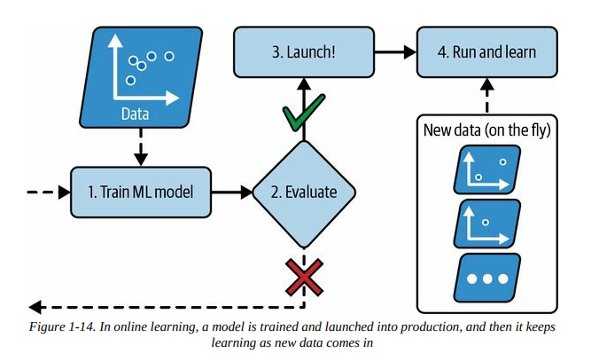

* Online learning is useful for sytsem that need to adapt to change extremely rapidly, such as detecting changes in the stock market. It is also good for systems with limited resources. 

* Online learning algorithms can be used to train models on huge datasets that cannot fit on one system's main memory, **out-of-core memory**.  
    * Out-of-core learning is usually done offline (not on live system), so online learning is not very accurate. Consider it closer to *incremental learning*. 
    * The algorithm loads part of the data, runs a training step on that data and repeats the process until it has run on all of the data. 

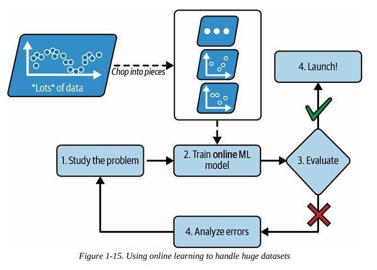

* One important parameter of online learning systems is the **learning rate**, or how fast the system should adapt to changing data. 
    * If your learning rate is *high* it will quickly adapt to new data, but will also tend to quickly forget the old data
    * If the learning rate is *low* the system will have more inertia (learn slower), but will be less sensitive to noise in the new data or to sequences of nonrepresentative data points, outliers. 

* A challenge of online learning is that feeding bad data into your system can cause it to decline in performance, potentially quickly. 
    * To counteract this, you must monitor your system closely and switch learning off if a performance drop-off is detected. 
        * You may even need to monitor the input data and react to abnormal data using an anomaly detection algorithm. 

### Instance-Based VS Model-Based Learning

* One of the ways we categorize ML sytems is by how they *generalize*. Most ML tasks are about making predictions. The two main approaches to ML system generalization is via **instance-based learning** and **model-based learning**

#### Instance-based learning

* The system will learn the examples by heart, then generalize to new cases by using similarity measures to compare them to learned examples, or a subset of them. 

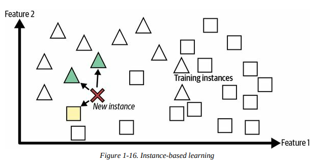

 In the above figure, the new instance would be classified as a triangle as the majority of most similar instances belong to the triangle class. 

#### Model-based learning and typical machine learning workflow 

* **Model-based learning** is to build a model from a set of examples and use that model to make predictions. 

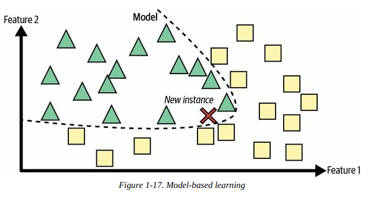

* For example, if we want to know if money makes people happy we might download the Better Life Index data from the OECD's website and World Bank stats about GDP per capita. You could then join these tables and sort by GDP per capita. The below table is what you would get: 

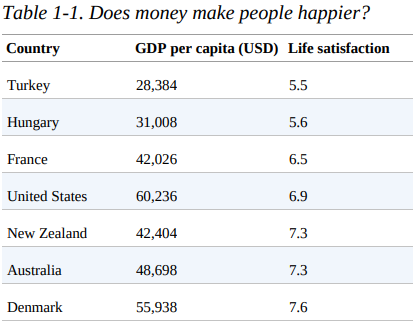

* Taking this table and plotting the data for these countries would result in this: 

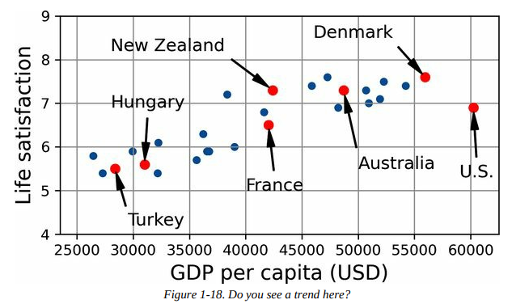

* From this plot, we can see a linear trend in life satisfaction as the GDP per capita increases. One could decide to model life satisfaction as a linear model of GDP per capita. 
    * This is called **model selection**; we selected a *linear model* of life satisfaction with one attribute, GDP per capita. 

* This linear model might look like:

$$
life\_satisfaction = \theta0 + \theta1 \times GDP\_per\_capita
$$

* This model has two **model parameters**, $\theta_0$ and $\theta_1$. By tweaking these parameters, you can make your model represent any linear function. 

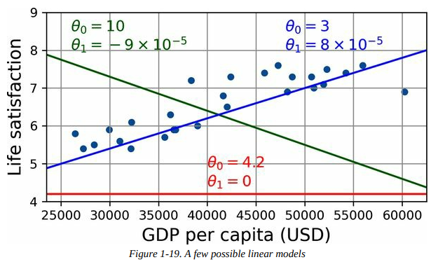

* Before we can use this model, however, we need to define parameter values $\theta_0$ and $\theta_1$. To figure this out, we need to specify a performance measure. 
    * You can accomplish this by either defining a **utility function** (or **fitness function**) that measures how *good* your model is. 
    * Alternatively, you can define a **cost function** that measures how *bad* your model is. 
        * For linear regression problems, cost functions that measure the distance between the linear model's predictions and the training examples are used, with the objective being to minimize the distance. 

* Linear regression algorithms are now used: feed in training examples and the algorithm finds the parameters that make the linear model fit best to your data. 
    * This is **training** the model

* From our prior example, the linear regression finds that the optimal parameter values are 

    $\theta_0 = 3.75$ and $\theta_1 = 6.78 \times 10^{-5}$

* These values result in the figure: 

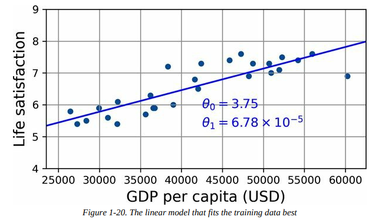

* Plugging in Cyprus's GDP per capita, $37,655, would result in: 

$$
3.75 + 6.78 \times 10^{-5} \times 37,655 = 6.30
$$ 

 If we had instead using an instance-based learning algorithm, we would have found Israel has the closest GDP per capita to that of Cyprus with a life satisfaction of $7.2$. This would have resulted in a life satisfaction of $7.2$ for Cyprus. Zooming out a bit and looking at the two next-closest countries, you find Lithuania and Slovenia with a life satisfaction of $5.9$ each. Averaging out the three satisfaction values would give $6.33$, which is close to the model-based prediction. This simple algorithm is called **k-nearest neighbors** regression where, in this example, $k = 3$.

## Main Challenges of Machine Learning

### Insufficient Quantity of Training Data 

* Due to the complexity of learning for a system, even for simple problems you typically need thousands of examples. For complex problems such as image or speech recognition, this number can go into the millions. 

    * In a famous paper pubished in 2001 by Microsoft researchers, it found that very different machine learning algorithms performed almost identically well on a complex problem of natural language disambiguation once they were given enough data.
    * The authors noted "these results suggest that we may want to reconsider the trade-off between spending time and money on algorithm development versus spending it on corpus development".
    * The idea that data matters more than algorithms for complex problems was further popularized by a paper titled "The Unreasonable Effectiveness of Data" and published in 2009. 
      * It should be noted that small and medium-sized datasets are still very much common and it is not always easy or cheap to collect training data. 

### Nonrepresentative Training Data

* It is imperative that your training data be representative of the new cases that you want to generalize to. 

* In our earlier examples of life satisfaction and country GDP per capita, it was not entirely representative as it did not contain any country with a GDP per capita lower than $\$23,500$ or higher than $\$62,500$. 
  * The figure below shows what would happen if such countries were included in the dataset:
  
  * If you train a linear model on the new data, the result would be the solid line, whereas our old model is represented by the dotted line. Excluding the countries we just added not only alters the model, but makes it clear that a simple linear model will not work well in this instance. \
    * By using a nonrepresentative training set, our old model is unlikely to make accurate predictions. 
* It is crucial to use training sets that are representative. 
  * If sample is too small, you will have **sampling noise**
    * nonrepresentative data as a result of chance
  * If sample method is flawed, the dataset can be nonrepresentative due to **sampling bias**
    * US Presidential Election of 1936
      * Literary Digest conducted a poll that sent mail out to 10 million people with 2.4 million responses. Predicted with high confidence that Republican would win with 57% of votes. The actual result was the Democrat winning with 62% of votes. 
      * They sent the polls using telephone directories, magazine subscribers, club members, and similar citizens. All of these groups were more likely to be wealthy, and as a result were more likely to vote Republican. 
      * Less than 25% of people answered the poll. This introduced a separate sampling bias by potentially ruling out parts of the population that didn't care for politics, people who did not like Literary Digest, and other groups. This type of sampling bias is called **nonresponse bias**. 
### Poor-Quality Data 

* If your training data is full of errors, outliers, and noise it will make it harder for the system to detect the underlying patterns. 
  * If some instances are clearly outliers, it may help to simply discard them or try to fix the errors manually
  * If some instances are missing a few features, you must decide if you want to ignore the attribute altogether, ignore those instances, or fill in the missing values, or train one model with the feature and one model without it

### Irrelevant features

* System will only be capable of learning if the training data contains enough relevant features and not too many irrelevant ones. 

* **Feature Engineering**:
  * **Feature Selection** → selecting the most useful features to train on among existing features
  * **Feature Extraction** → combining existing features to produce a more useful one; think of dimensionality reduction algorithms
  * Creating new features by gathering new data

### Overfitting the Training Data

* The model performs well on the training data, but does not generalize well
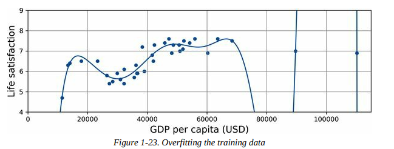

* Overfitting happens when the model is too complex relative to the amount and noisiness of the training data. Solutions: 
  * Simplify the model by selecting one with fewer parameters (linear model vs high-degree polynomial model), by reducing the number of attribute in the training data, or by constraining the model
  * Gather more training data
  * Reduce noise in the training data (fix data and remove outliers)

* Constraining and simplifying a model to reduce the risk of overfitting is called **regularization**. 
  * In the earlier linear model we created, it had two parameters, $\theta_0$ and $\theta_1$. This gives the algorithm two **degrees of freedom** to adapt the model to the training data
    * It can tweak both the height ($\theta_0$) and the slope ($\theta_1$) of the line. 
  * If we forced $\theta_1 = 0$, then the algorithm would only have one degree of freedom and would have a much harder time fitting the data properly. This would likely result in some simple solution, like a mean. 

* Find the right balance between fitting the training data perfectly and keeping the model simple enough to ensure that it will generalize well. 

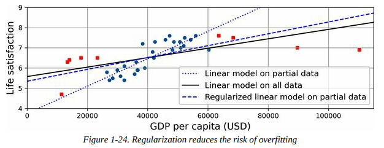

* In the figure above: 
  * The dotted lines represent the original model that was trained on the countries represented as circles (without the countries represented as squares).
  * The solid line is our second model trained with ALL countries (circles and squares)
  * The dashed line is a model trained with the same data as the first model, but with a regularization constraint. This constraint forced the model to have a smaller slope. This model does not fit the training data (circles) as well as the first model, but generalizes better to new examples (squares). 

* The amount of regularization applied during learning can be controlled by a **hyperparameter**. It is a parameter of the learning algorithm (not of the model) and, as such, is not affected by the algorithm itself. It must be set prior to training and remains constant during the training. 
  * A high hyperparameter will result with a flat model (a slope close to zero). It will not overfit, but will not usually find a good solution

### Underfitting the Training Data

* The opposite of overfitting (duh), your model is too simple to learn the underlying structure of the data. The main options for solutions are:
  * Selecting a more powerful model, with more parameters
  * Better features for the learning algorithm (**feature engineering**)
  * Reduce constraints on the model (ie. reducing the regularization hyperparameter)

## Testing and Validating

* Split your data into two sets, **training set** and **test set**.  
  * The error rate on new cases is called the **generalization error** or **out-of-sample error**.
    * Can find an estimate of this error by evaluating how the model performs with the test set and indicates how well your model with perform on instances it has never seen before.
  * If the training error is low, but the generalization error is high, then your model is *Overfitting* the training data. 
  * It is common to do an 80/20 split for training and test data. However, if you have many instances, say 10 million, then holding out 1% means your test set will still contain 100,00 instances. This can be more than enough to get a good estimate of the generalization error.

### Hyperparameter Tuning and Model Selection

* Sometimes we can hyperfixate on the results from our singular training set. Our model may outperform its potential on one particular set. 
  * A common solution to this problem is **holdout validation**
    * Simply hold out part of the training set to evaluate several candidate models and select the best one
    * The new heldout set is called the **validation set** (or **development/dev set**)
    * More specifically, you can train multiple models with different hyperparameters on the reduced training set and select the model that performs the best on the validation set. After this holdout validation process, you train the best model on the full training set (including validation set) and this gives you your final model. 
    * Lastly, you evaluate this final model on the test set to get an estimate of the generalization error

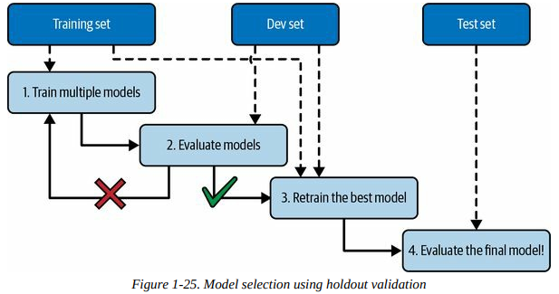

* This solution can work quite well, but if the validation set is too small then the model evaluations will be imprecise. If the validation set is too large, the remaining training set will be smaller than the full training set. This is not ideal as you will be comparing candidate models trained on a much smaller training set. 
  * This can be solved by performing repeated **cross-validation**, using many small validation sets. 
    * Each model is evaluated once per validation set after it is trained on the rest of the data. You can average out the evaluations of the model to get an accurate measure of its performance. The only drawback is that the training time is a factor of the number of validation sets. 

### Data Mismatch

* Sometimes it is easy to get a large dataset, but not all instances will be perfectly representative of what you may be training or testing for. 
  * The most important rule is that both the validation and test sets MUST be as representative as possible of the data you expect to use in production. 
  * If you unknowingly input bad or unrepresentative data, it will be hard to distinguish if the model is overfitting the training set or if there is a mismatch within the data itself. 

* One solution is to hold out some of the training data in another set that has been dubbed a **train-dev set** (shown below).

    

* After the model is trained on the training set, you can evaluate it on the train-dev set. 
  * If the model performs poorly, then it must have overfit the training set, which can be fixed by simplifying or regularizing the model, getting more training data, and cleaning up the training data. 
  * If the model performs well on the train-dev set, then you can evaluate the model on the dev set
    * If it performs poorly, then the problem must be coming from a data mismatch. 

#### No Free Lunch Theorem

* A model is a simplified representation of data. These simplifications are meant to discard the superflous details that are unlikely to generalize new instances. When you select a type of model, you implicitly make assumptions about the data. 

* In a 1996 paper, David Wolpert demonstrated that if you make ZERO assumptions about the data, then there is no reason to prefer one model over any other. This is the **No Free Lunch Theorem**. 
  * For some datasets the best model is a linear one, for others it may be a neural network. There is no model that is guaranteed to work better. The only way to know is to evaluate them all. 
    * However, this is not possible. In practice you make reasonable assumptions about the data and evaluate only a few "reasonable" models. 

## Exercises

1. How would you define machine learning?

    Machine Learning can be defined as  building systems that can learn from data to perform a task, given some measure or evaluation of performance. 

2. Can you name four types of applications where it shines?
    
    * Complex problems where there is no algorithmic solution, replacing solutions that require a laundry list of complicated rules, building systems to evaluate and handle volatile environments, and assisting humans in learning and analyzing. 

3. What is a labeled training set?
    
    * A labeled training set is a dataset where the instances within the training set have been labeled with the desired classification of the instance. 

4. What are the two most common supervised tasks?
    
    * Regression and Clasification  

5. Can you name four common unsupervised tasks?
    
    * 

6. What type of algorithm would you use to allow a robot to walk in
various unknown terrains?
    
    * Reinforcement Learning

7. What type of algorithm would you use to segment your customers into
multiple groups?
    
    * You can use either clustering algorithms (unsupervised learning) or classification algorithms (supervised learning) depending on if you have prococeived labels for these groups. 

8. Would you frame the problem of spam detection as a supervised
learning problem or an unsupervised learning problem?
    
    * Supervised as spam detection programs are fed example emails of either spam or ham.  

9. What is an online learning system?
    
    * A system that learns incrementally based on newly inputted data instances. 

10. What is out-of-core learning?
    
    * Learning that occurs outside of a system's main memory. It will subdivide groups of data and learn from them via online learning. 

11. What type of algorithm relies on a similarity measure to make
predictions?
    
    * Instance-based algorithms rely on similarity measures. 

12. What is the difference between a model parameter and a model
hyperparameter?
    
    * A model parameter can be adjusted while learning for generalization of new instances, but a model hyperparameter is a parameter that must be set prior to learning and is static throughout the learning process as it a parameter of the algorithm rather than the model. 

13. What do model-based algorithms search for? What is the most common
strategy they use to succeed? How do they make predictions?
    
    * Model-based algorithms search for values for the model parameters so that the model will generalize to new instances accurately. This is usually accomplished via cost function with penalities depending on regularization. To predict, we input new instances into the model predictive function to see if the new instances stay aligned with the function itself. 

1.  Can you name four of the main challenges in machine learning?
    
    * Overfitting and Underfitting of Data, Poor Quality Data, and Irrelevant Features. 

15. If your model performs great on the training data but generalizes poorly
to new instances, what is happening? Can you name three possible
solutions?

    * Overfitting is occurring in this instance. Three solutions are to simplify the model via regularization, collecting more data, or reducing the noise within the data. 

16. What is a test set, and why would you want to use it?
    
    * A test set is a portion of the data that we test our models on after they have performed well with the training and potentially the validation sets. You want to use the test set to estimate the generalization error of a model. 

17. What is the purpose of a validation set?
    
    * A validation set is a portion of the training set that is used to test multiple models at one time to see which one will perform well enough to be passed onto the training and potentially test sets. It is also used to adjust hyperparameters. 

18. What is the train-dev set, when do you need it, and how do you use it?
    
    * The train-dev set is used to evaluate the risk of data mismatch within a training set and the data within testing or validation sets. It is part of the training set that is held out. The model is then trained on the reminaing training set data and evaluated on the train-dev and validation sets. If it performs well on the training, but not on the train-dev then it is likely overfitting. If it performs well on training and train-dev, but not on the validation set then there is likely a data mismatch and steps should be taken to improve the representativeness of the training data.

19. What can go wrong if you tune hyperparameters using the test set?
    
    * You might overfit the test set and cause the model to overperform with the generalization error relative to your set, and the model will suffer in production. 