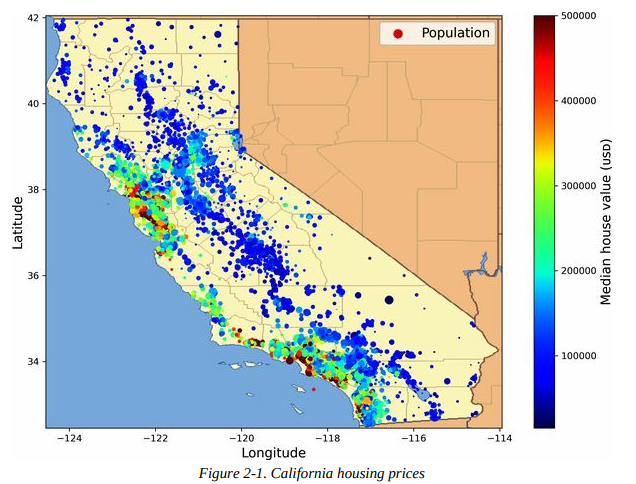
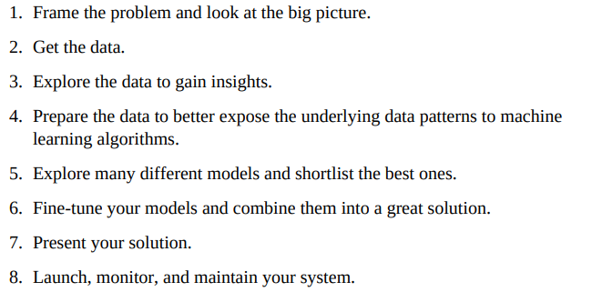
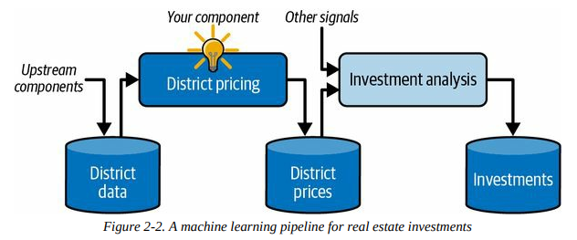

**Chapter 2 - End-to-End Machine Learning Project**

**Table of Contents**

- [Working with Real Data](#working-with-real-data)
- [Look at the Big Picture](#look-at-the-big-picture)
  - [Frame the Problem](#frame-the-problem)
      - [Pipelines](#pipelines)

# Working with Real Data

- In this chapter we will be using the California Housing Prices dataset StatLib repo. 

# Look at the Big Picture 

- First task is to use California census data to build a model of housing prices in the state, including metrics such as popualtion, median income, and median housing price for each block group in California. 
  - Block groups are the smallest geographical unit for which the US Census Bureau publishes sample data (typically $600$ to $3,000$ people)
    - **districts** for short
- **Machine Learning Checklist:** 

    

## Frame the Problem

* From a corporate perspective, first you might consider the business objective
  * How can the company use and benefit from this model?
* Knowing this objective is important, determines how you frame the problem, which algorithms to select, which performance measure you will use to evaluate the model, and how much effort will be spent tweaking

* In our case, our model's output (prediction of district's median housing price) will be fed to another machine learning system along with other **signals**, pieces of info fed to a machine learning system. 

* This downstream system will determine if it is worth investing into a given area. 

#### Pipelines

* A sequence of data processing components is called a **data pipeline**.
  * Pipelines are common in ML systems, since there is a lot of data to manipulate and many data transformations to apply.

* Components typically run asynchronously. Each component pulls in a large amount of data, processes it, and spits out the result in another data store. 
  * Later, the next component in the pipeline pulls in the data and spits out its own output. 
  * Each component is fairly self-contained: the interface between components is simply the data store. 
  * This simplifies the system. If a component breaks down, the downstream components can often continue to run normally by just using the last output from the broken component. 
    * This makes the architecture very robust. 
    * However, this also means broken components can go unnoticed for some time if not monitored closely. The data will get stale and the overall system performance will drop.
* This is a **supervised**, **multiple regression** model (since the system will use multiple features to make a prediction).
  * It is also a **univariate regression** problem, since we are only trying to predict a single value for each district. 
    * If it were multiple values, it would be **multivariate regression**.
* Since there is no continuous flow of data coming in, it is a simple **batch learning** problem. 