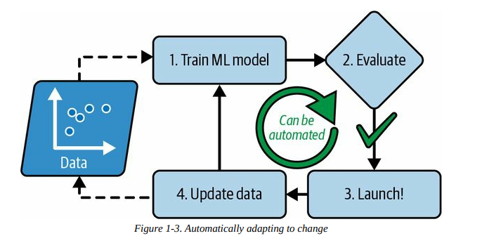
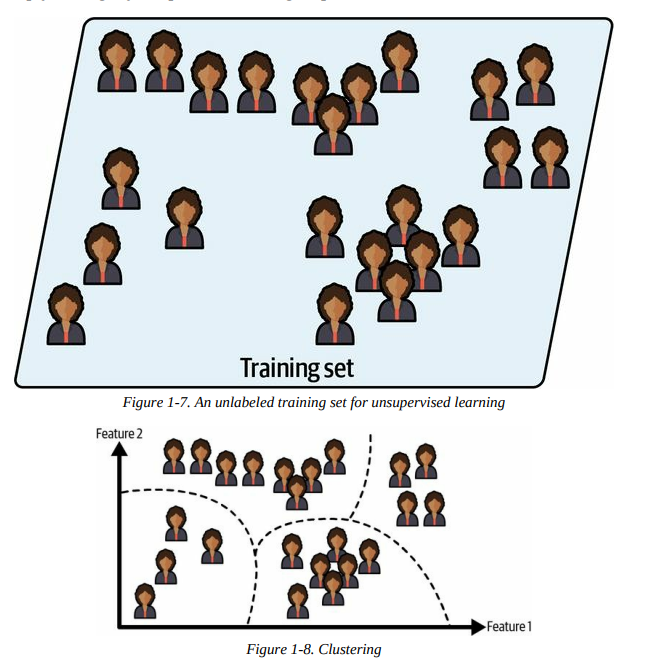
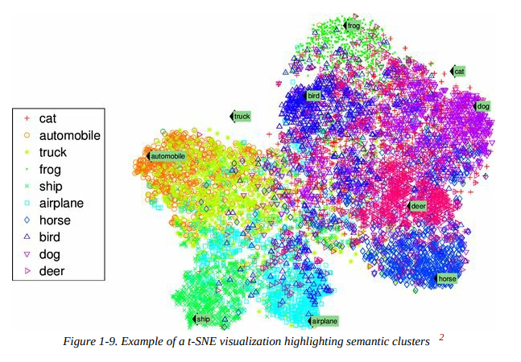
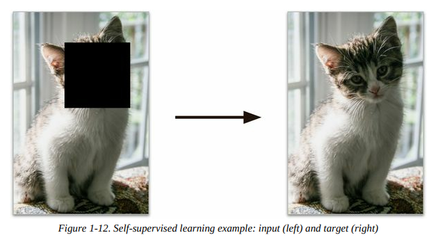
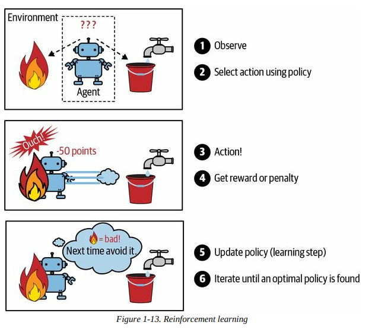
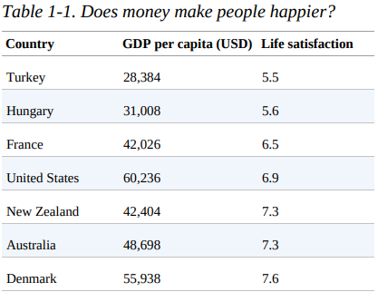
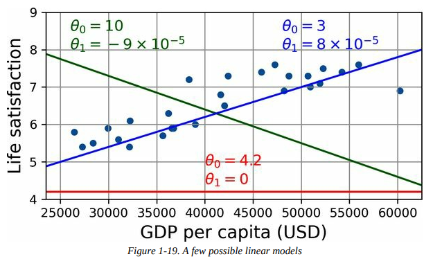

# Table of Contents 
1. [Chapter 1](#chapter-1)
    * [What is Machine Learning](#what-is-machine-learning)
    * [Why Use Machine Learning?](#why-use-machine-learning)
        * [Examples](#examples)
    * [Types of Machine Learning Systems](#types-of-machine-learning-systems)
        * [Training Supervision](#training-supervision)
            1. [Supervised Learning](#1-supervised-learning)
            2. [Unsupervised Learning](#2-unsupervised-learning)
            3. [Semi-Supervised Learning](#3-semi-supervised-learning)
            4. [Self-Supervised Learning](#4-self-supervised-learning)
            5. [Reinforcement Learning](#5-reinforcement-learning)
        * [Batch VS Online Learning](#batch-vs-online-learning)
            * [Batch Learning](#batch-learning)
            * [Online Learning](#online-learning)
        * [Instance-Based Learning vs Model-Based Learning](#instance-based-vs-model-based-learning)
            * [Instance-Based Learning](#instance-based-learning)
            * [Model-based learning and typical machine learning workflow](#model-based-learning-and-typical-machine-learning-workflow)
    * [Main Challenges of Machine Learning](#main-challenges-of-machine-learning)

# Chapter 1

## What is Machine Learning 

- Machine Learning is the study that gives computers the ability to learn without being explicitly programmed.  
    - Spam Filter 

- Part of ML System that is used to learn is the *training set* / *training instance* / *sample*
- Part of ML System that learns and makes predictions is called a *model* 
    - Neural Networks and Random Forests are examples of models

## Why Use Machine Learning?

- Machine Learning models can learn based on new data and change rules on the fly. 
    - ML Spam Filters can detect words and phrases that are used in spam. 

- ML also good for problems that are too complex for traditional coding approaches or have no known algorithm

- ML models can also be used to learn from the data set they learn from. We can dig into large amounts of data to discover hidden patterns, **data mining**.

### Examples
1. Image analysis of products on a production line to auto classify them
    - Image classification, typically done using **convolution neural networks** (CNN) or using **transformers**
2. Detecting tumors in brain scans
    - Semantic image segmentation, where each pixel is classfiied. Typically done using **CNNs** or **transformers**
3. Auto classifying news articles
    - **Natural Language Processing**(NLP), more specifically text classification. Tackled by **recurrent neural networks** (RNNs) and **CNNs**, but **transformers** work even better
4. Auto-summarize long documents
    - Branch of **NLP** called text summarization
5. Chatbots / Personal Assistants
    - **Natural Language Understanding** (NLU) and question-answering modules
6. Forecasting company revenue for the next year
    - Regression task handled by any regression model such as **linear regression** or **polynomial regression**, **regression support vector machine**, **regression random forest**, **artificial neural network**. If you want to take into account sequences of past performance metrics, may want to use **RNNs**, **CNNs**, or **transformers**. 

## Types of Machine Learning Systems

* We classify machine learning systems into broad categories based on following criteria:
    * How they are supervised during training
        * **Supervised, unsupervised, semi-supervised, self-supervised, and others**
    * Whether or not they can learn incrementally on the fly
        * **online vs batch-learning**
    * Whether they work by simply comparing new data points to known data points, or instead by detecting patterns in training data and building a predictive model 
        * **instance-based vs model-based learning**
* These criteria are not exclusive and can be combined in any way you like

### Training Supervision

* ML Systems can be classified according to amount and type of supervision they get during training. 

#### 1. Supervised Learning

* Training set that is fed into algorithm also includes desired solutions

* Typical supercised learning task is **classification**.
    * Spam filter is trained with many example emails along with their **class**, spam or ham in this case, and must learn how to classify new emails

* Another task is to predict a target numeric value, such as price of a car given features. This is called **regression**.
    * Need to give the system many examples of cars, including features and targets. 
* Some regression models can be used for classification as well and vice versa. 
    * **Logistic Regression** is commonly used for classification, as it ouputs a value that corresponds to the probability of belonging to a given class. 

#### 2. Unsupervised Learning

* Training data is unlabeled and the system tries to learn without a teacher. 
    * For example, data on your blog's visitors. Run a *clustering algorithm* to try and detect groups of similar visitors. The algorithm should find connections without your intervention. 
        * This can be expanded upon with **hierarchical clustering** that will subdivide each group into smaller groups. 

* **Visualization** algorithms are also examples of unsupervised learning. They will output 2D or 3D representation of complex and unlabeled data and will attempt to preserve as much structure as possible. 
    * Related task is **dimensionality reduction**, where the goal is to simplify the data without losing too much information. 
        * One way to accomplish this is to merge several correlated features into one.
        * A car's mileage may be strongly correlated to its age, so the *dimensionality reduction algorithm* will merge them into one feature that represents the car's wear and tear. This is **feature extracion**

* **Anomaly Detection** is used to detect outliers in a data set 
    * Detect fraudulent credit card transactions, manufacturing defects, auto-remove outliers from a data set before feeding it into learning algorithm. 
    * **Novelty Detection** aims to detect new instances that look different from all instances in a set. 
        * Requires having a very clean training set, without any instance that you would like the algorithm to detect. 
        * If you have thousands of pictures dogs and 1% are Chihuahuas, a *novelty detection algorithm* should not treat new pictures of Chihuahaus as novelties. 
            * *Anomaly detection algorithms* may consider these dogs so rare and different from other dogs that they would be classified as anomalies. 

* **Association Rule Learning** is used with the goal of digging into large amounts of data and discover interesting relations between attributes. 
    * If you ran a supermarket and ran an association rule on your sales log, you might find that people who buy bbq sauce and potato chips also tend to buy steak. This might affect how you place these items around your store.

#### 3. Semi-Supervised Learning

* Training set has labeled AND unlabeled instances. The data set is considered partially labelled. 

* Google Photos does this by recognizing Person A in pictures 1, 5, and 11, while Person B shows up in 2, 5, and 7. This part of the algorithm is *unsupervised* (clustering). The system might ask you to label these people, and once you add one label per person it will be able to name everyone in every photo. This can be used later to search for people in photos.

* Most semi-supervised learning algorithms are combos of unsupervised and supervised algorithms. 
    * A clustering algorithm might be used to group similar instances together, and then every unlabeled instance can be labeled with the most commo label in its cluster. Once the whole dataset is labeled, it can be run into any supervised learning algorithm. 

#### 4. Self-Supervised Learning

* Machine Learning model generates a fully labeled dataset from a completely unlabeled set. Once the set has been labeled by the model completely, it can be run through any *supervised* learning algorithm. 

* If you had a large dataset of unlabeled images, you can randomly mask a small part of each image and train the model to recover the original image. 
    * During training, the masked images are used as inputs to the model and the original images are used as labels. 

* This can be used to repair damaged images or to erase unwanted objects from pictures. 

* A model trained on self-supervised learning is often not the final goal. You will usually want to use the knowledge gained by the model in this time and transition it to another purpose. 
    * You could train a model to repair images of different animal species, wherein it will eventually know how to repair images of cats and dogs correctly. This has implied understanding of recognizing and distinguishing different animal species. 
    * Transferring knowledge from one task to another is called **transfer learning**. 

#### 5. Reinforcement Learning

* How it works:
    * The learning system, called the **agent**, can observe the environment, select and perform actions, and get rewards in return (or *penalties* in the form of negative rewards)
    * It must then learn by itself what is the best strategy, or **policy** to get the most reward over time. A **policy** defines what action the agent shoudl choose when it is in a given sitaution. 

* The most prominent example would be DeepMind's AlphaGo program
    * Beat the number one ranked Go player at the time, Ke Jie, in May 2017
    * Learned its winning policy by analyzing millions of games and then playing many games against itself. 
        * Learning was turned off during the game against Jie; AlphaGo was merely applying the policy it had learned. This is **offline learning**. 

### Batch VS Online Learning

#### Batch Learning

* The system is incapable of learning incrementally; it must be trained using all the available data beforehand. This typically takes a lot of resources, so it is done offline most times. 

* First, the system is trained, and then is launched into production and runs without learning anymore; it just applies what it has learned. 
    * **Offline Learning**

* Unfortunately, as the world continues to evolve while the model remains the same, the model's performance tends to decay over time. This is called **model rot** or **data drift**. 
    * The solution is to retrain the model regularly on up-to-date data.
    * If you want a batch learning system to know about new data, you need to train new versions of the system from scratch on the FULL dataset, then replace the old model with the new one. 
        * This is very costly as training on the entire dataset repeatedly requires a lot of computer resources, storage, and, in the long run, money. 
        * This solution also does not work if your system has limited resources (mobile devices, such as smartphones, or even a rover on Mars)

#### Online Learning

* Train the system by feeding it data instances sequentially, either individually or in small groups called **mini-batches**. Each learning step is fast and cheap, so the system can learn about new data on the fly as it arrives. 

* Online learning is useful for sytsem that need to adapt to change extremely rapidly, such as detecting changes in the stock market. It is also good for systems with limited resources. 

* Online learning algorithms can be used to train models on huge datasets that cannot fit on one system's main memory, **out-of-core memory**.  
    * Out-of-core learning is usually done offline (not on live system), so online learning is not very accurate. Consider it closer to *incremental learning*. 
    * The algorithm loads part of the data, runs a training step on that data and repeats the process until it has run on all of the data. 

* One important parameter of online learning systems is the **learning rate**, or how fast the system should adapt to changing data. 
    * If your learning rate is *high* it will quickly adapt to new data, but will also tend to quickly forget the old data
    * If the learning rate is *low* the system will have more inertia (learn slower), but will be less sensitive to noise in the new data or to sequences of nonrepresentative data points, outliers. 

* A challenge of online learning is that feeding bad data into your system can cause it to decline in performance, potentially quickly. 
    * To counteract this, you must monitor your system closely and switch learning off if a performance drop-off is detected. 
        * You may even need to monitor the input data and react to abnormal data using an anomaly detection algorithm. 

### Instance-Based VS Model-Based Learning

* One of the ways we categorize ML sytems is by how they *generalize*. Most ML tasks are about making predictions. The two main approaches to ML system generalization is via **instance-based learning** and **model-based learning**

#### Instance-based learning

* The system will learn the examples by heart, then generalize to new cases by using similarity measures to compare them to learned examples, or a subset of them. 

 In the above figure, the new instance would be classified as a triangle as the majority of most similar instances belong to the triangle class. 

#### Model-based learning and typical machine learning workflow 

* **Model-based learning** is to build a model from a set of examples and use that model to make predictions. 

* For example, if we want to know if money makes people happy we might download the Better Life Index data from the OECD's website and World Bank stats about GDP per capita. You could then join these tables and sort by GDP per capita. The below table is what you would get: 

* Taking this table and plotting the data for these countries would result in this: 

* From this plot, we can see a linear trend in life satisfaction as the GDP per capita increases. One could decide to model life satisfaction as a linear model of GDP per capita. 
    * This is called **model selection**; we selected a *linear model* of life satisfaction with one attribute, GDP per capita. 

* This linear model might look like:

$$
life\_satisfaction = \theta0 + \theta1 \times GDP\_per\_capita
$$

* This model has two **model parameters**, $\theta_0$ and $\theta_1$. By tweaking these parameters, you can make your model represent any linear function. 

* Before we can use this model, however, we need to define parameter values $\theta_0$ and $\theta_1$. To figure this out, we need to specify a performance measure. 
    * You can accomplish this by either defining a **utility function** (or **fitness function**) that measures how *good* your model is. 
    * Alternatively, you can define a **cost function** that measures how *bad* your model is. 
        * For linear regression problems, cost functions that measure the distance between the linear model's predictions and the training examples are used, with the objective being to minimize the distance. 

* Linear regression algorithms are now used: feed in training examples and the algorithm finds the parameters that make the linear model fit best to your data. 
    * This is **training** the model

* From our prior example, the linear regression finds that the optimal parameter values are 

    $\theta_0 = 3.75$ and $\theta_1 = 6.78 \times 10^{-5}$

* These values result in the figure: 

* Plugging in Cyprus's GDP per capita, $37,655, would result in: 

$$
3.75 + 6.78 \times 10^{-5} \times 37,655 = 6.30
$$ 

 If we had instead using an instance-based learning algorithm, we would have found Israel has the closest GDP per capita to that of Cyprus with a life satisfaction of 7.2. This would have resulted in a life satisfaction of 7.2 for Cyprus. Zooming out a bit and looking at the two next-closest countries, you find Lithuania and Slovenia with a life satisfaction of 5.9 each. Averaging out the three satisfaction values would give 6.33, which is close to the model-based prediction. This simple algorithm is called k-nearest neighbors regression where, in this example, k = 3.

## Main Challenges of Machine Learning

